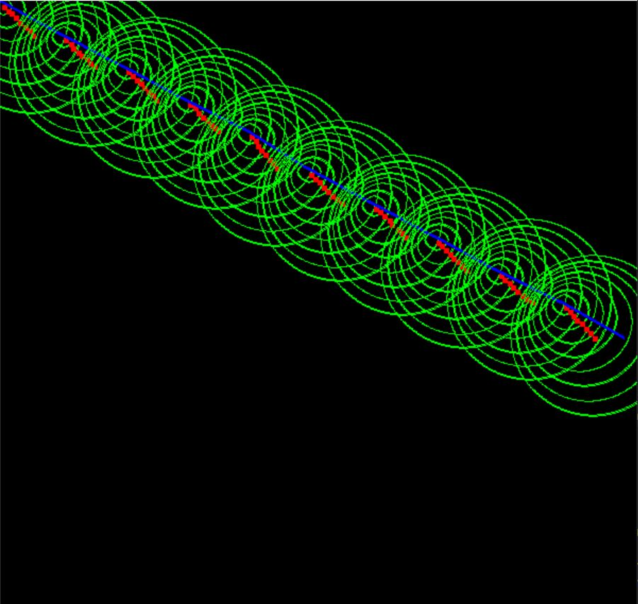
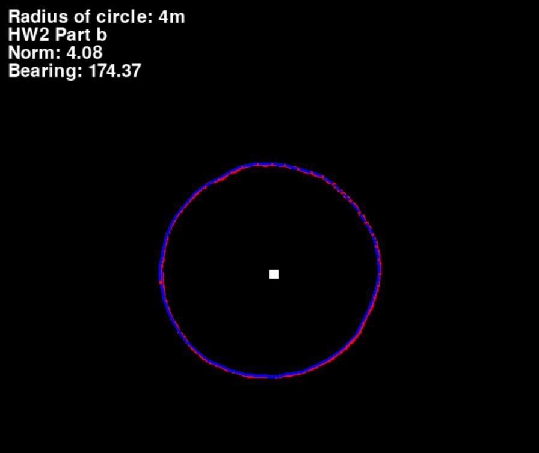

# State-Estimation
Practice programs for simple state estimation problems in robotics.

Reference: *State Estimation for Robotics (2020)* by Timothy D. Barfoot.

Link to youtube playlist: 

https://www.youtube.com/watch?v=wGZgDfA37xA&list=PLOxq1EUcxzrKmPDE9FOWAIaEXC9lrWu0h&ab_channel=GlennShimoda

# Assignments Overview

__HW1__: Basic Kalman Filter for a linear motion robot. Uses linear motion and observation models and the robot moves in a straight line diagonally.

__HW2__: Extended Kalman Filter, using both the linear measurement model from HW1 and a new measurement model that uses distance and bearing between the robot and a landmark.

