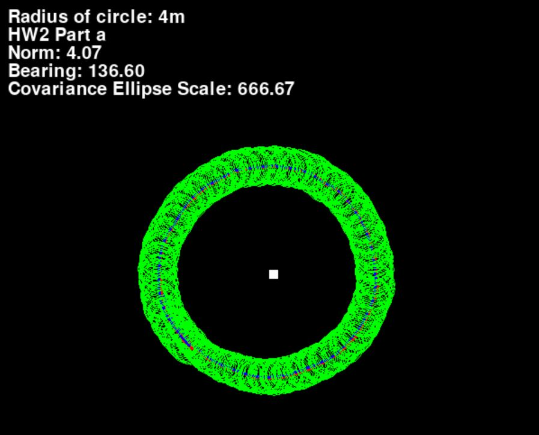
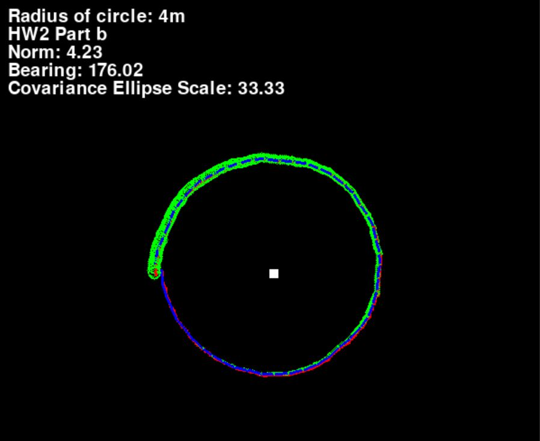
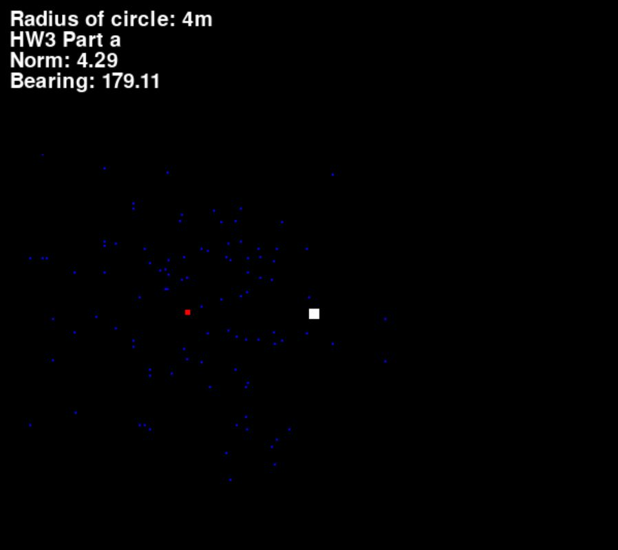
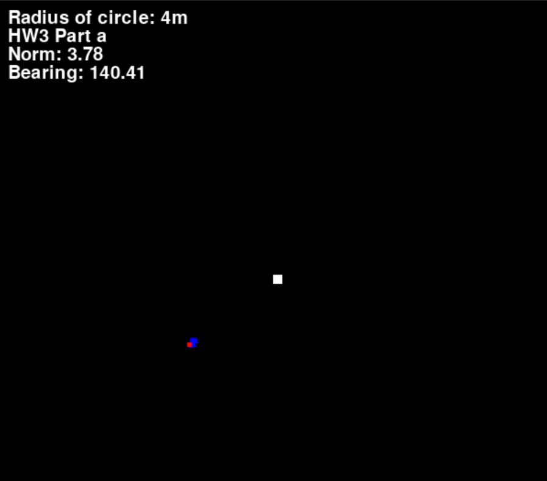

# State-Estimation
Practice programs for simple state estimation problems in robotics.

Reference: *State Estimation for Robotics (2020)* by Timothy D. Barfoot.

Link to YouTube playlist: 

https://www.youtube.com/watch?v=jsQ5yIhPXb4&list=PLOxq1EUcxzrKmPDE9FOWAIaEXC9lrWu0h&ab_channel=GlennShimoda

# Implement Code

Clone the repository:

```bash
git clone https://github.com/TakShimoda/ME8135-State-Estimation.git
```

Create a virtual environment:

```bash
pip install virtualenv
```

```bash
cd ME8135-State-Estimation
```

```bash
virtualenv ME8135
```

```bash
ME8135\Scripts\activate
```

Install the dependencies:

```bash
install -r requirements.txt
```

# Assignments Overview

__HW1__: Basic Kalman Filter for a linear motion robot. Uses linear motion and observation models and the robot moves in a straight line diagonally.


YouTube Link:

<a href="https://www.youtube.com/watch?v=jsQ5yIhPXb4&list=PLOxq1EUcxzrKmPDE9FOWAIaEXC9lrWu0h&index=1&ab_channel=GlennShimoda
" target="_blank"></a>

__HW2__: Extended Kalman Filter, using both the linear measurement model from HW1 and a new measurement model that uses distance and bearing between the robot and a landmark.


YouTube Links for simulations with covariance ellipses:

<a href="https://www.youtube.com/watch?v=fep5FUxQIv4&list=PLOxq1EUcxzrKmPDE9FOWAIaEXC9lrWu0h&index=2&ab_channel=GlennShimoda
" target="_blank"></a>

<a href="https://www.youtube.com/watch?v=uFtIHzXpDYc&list=PLOxq1EUcxzrKmPDE9FOWAIaEXC9lrWu0h&index=5&ab_channel=GlennShimoda
" target="_blank"></a>

__HW3__: Particle Filter, using the same same set up from HW2 (linear measurement model and bearing between robot and a landmark)



Initial particles in blue. Red is the ground truth(robot motion with no noise)



After particles converged.

YouTube Links for simulations with linear and nonlinear measurements:

<a href="https://www.youtube.com/watch?v=ZaF_GBYmXps&list=PLOxq1EUcxzrKmPDE9FOWAIaEXC9lrWu0h&index=6&ab_channel=GlennShimoda
" target="_blank">Part 1: Linear Measurements</a>

<a href="https://www.youtube.com/watch?v=MFTPh9TmVWc&list=PLOxq1EUcxzrKmPDE9FOWAIaEXC9lrWu0h&index=7&ab_channel=GlennShimoda
" target="_blank">Part 2: Nonlinear Measurements</a>
